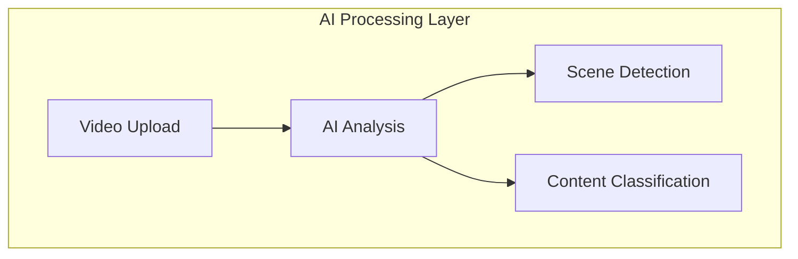

# Vidrune 🎥ᚱ

  [Banner Image Placeholder - showing video indexing and AI analysis visualization]

📖 [Documentation](#) | 🎯 [Demo](#) | 🔗 [API Reference](#)

## 🌟 Overview

Vidrune is a decentralized platform that leverages Hedera's smart contract service (HSCS) and Crystalrorh's media services to create searchable, verifiable, and monetizable video indexes. 

Built during the Hedera Hello Future Hackathon 2.0 2024, it enables content creators to tokenize their video content while allowing users to discover and purchase specific video segments based on AI-driven insights.

## ✨ Features

- 🎥 AI-Powered Video Analysis
- 🔍 Granular Scene Search
- 🔐 Decentralized Storage
- 💎 NFT Minting for Videos
- 💰 Pay-per-Scene Model
- 🤖 Automated Metadata Generation

## 🚀 Technical Architecture

## 🎯 Use Cases

- 📺 Content Creators: Monetize video segments
- 🎬 Video Producers: Create searchable content libraries
- 🔍 Researchers: Find specific video content
- 🎨 Creative Industries: Source specific scenes

## 📄 License

Distributed under the MIT License.

## 🏆 Hackathon Track

This project was built for the "Data Integrity and AI-Driven Insights" track at Hedera Hackathon 2024, focusing on:

- AI-powered video analysis
- Decentralized data integrity
- Smart contract automation
- Content monetization

## 👥 Team

- [Kelvin Praises](https://x.com/kelvinpraises) - AI ✘ Smart Contract ✘ Fullstack
- [Daniel Aitanun](https://www.linkedin.com/in/danielaitanun/) - Design ✘ UX ✘ Flow

## 📊 Project Status

- [x] Basic Video Processing
- [x] AI Integration
- [x] Smart Contract Development
- [ ] Mobile VISE
- [ ] Advanced Search Features
